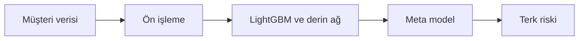

<div align="center">

# Telco Churn Analysis

### Müşteri verisini anlamlı risk sinyallerine dönüştür.


[](LICENSE)

Telekomünikasyon müşteri verilerinden terk olasılığını tahmin eden, model karşılaştırması ve web paneli içeren makine öğrenmesi projesi.

**Müşteri terk riski analizi**

[Projeyi keşfet](https://github.com/silanpehlivan/Musteri_Terk_Analizi_Projesi/tree/main) · [Kurulum ve ayrıntılar](#projeyi-çalıştırmak-ve-incelemek)

</div>

---

## İçeride neler var?

- **01** · Optuna ile LightGBM optimizasyonu
- **02** · MLP ve OOF stacking model yaklaşımı
- **03** · F1 skoruna göre model seçimi ve risk gösterimi

## Projeyi çalıştırmak ve incelemek

<details>
<summary><strong>Kurulum, kod yapısı ve teknik notları aç</strong></summary>

## Öne Çıkanlar

- Optuna ile LightGBM optimizasyonu
- MLP ve OOF stacking model yaklaşımı
- F1 skoruna göre model seçimi ve risk gösterimi

## Teknolojiler

Python · Flask · LightGBM · Keras

### Teknik yaklaşım

Sayısal ölçekleme ve kategorik one-hot dönüşümü sonrası LightGBM ve derin ağ olasılıkları bir meta modele aktarılır. Ayrı eğitim betikleri farklı ensemble yaklaşımlarını incelemeye imkân verir.



### Kodu incelemeye başlayın

- [app.py](app.py)
- [train_deep_model.py](train_deep_model.py)
- [train_lgbm.py](train_lgbm.py)
- [train_optuna_stack.py](train_optuna_stack.py)

### Kapsam ve sınırlar

Saklanan metrikler belirli bir deneyin çıktısıdır; canlı müşteri davranışına genelleme veya nedensel açıklama kanıtı olarak değerlendirilmemelidir.

## Kayıtlı deney sonuçları

[models/metrics.json](models/metrics.json) içindeki değerler aşağıdadır. Modeller bu belge güncellemesi sırasında yeniden eğitilmemiştir; farklı eğitim betiklerinin çıktıları tek bir deney protokolü olarak varsayılmamalıdır.

| Model | Accuracy | Precision | Recall | F1 |
|---|---:|---:|---:|---:|
| lightgbm | 80.77% | 68.07% | 51.87% | 58.88% |
| deep_nn | 79.77% | 64.40% | 53.21% | 58.27% |
| stack | 80.77% | 67.82% | 52.41% | 59.13% |
| jupyter_mlp | 74.66% | 51.96% | 60.16% | 55.76% |

Accuracy tek başına yeterli değildir: saklanan stacking sonucu %59,13 F1 ve %52,41 recall içerir. Bu değerler modelin kaçırdığı pozitif örneklerin de değerlendirilmesini gerektirir.


Telekomünikasyon sektöründe müşteri kaybını minimize etmek için geliştirilmiş, uçtan uca makine öğrenmesi ve interaktif yönetim panelini içeren bir çözümdür. Ham veriden tahmine kadar tüm süreç modüler bir yapıda kurgulanmıştır.

## Projenin Amacı

Müşterilerin abonelik iptal etme olasılıklarını önceden tahmin ederek; özel kampanyalar ve indirimler gibi proaktif önlemler alınmasını sağlamaktır.

## Teknik Mimari ve Model Stratejisi

Projede yüksek doğruluk için hibrit bir modelleme yaklaşımı benimsenmiştir:

- **LightGBM:** Optuna ile hiperparametre optimizasyonu yapılmış, hızlı ve yüksek performanslı gradyan artırma algoritması.

- **Derin Öğrenme (MLP):** Keras tabanlı, BatchNormalization ve Dropout katmanlarıyla normalize edilmiş Çok Katmanlı Algılayıcı.

- **OOF Stacking:** Modellerin tahminlerini birleştiren Logistic Regression tabanlı meta-model.

- **SMOTE:** Veri setindeki dengesiz sınıf dağılımını (terk eden müşteriler) yönetmek için kullanılmıştır.

## Teknoloji Yığını

### Backend
- Python
- Flask

### Frontend
- HTML5
- CSS3
- Jinja2
- Chart.js

### Veri Bilimi
- Scikit-learn
- Pandas
- TensorFlow/Keras
- Optuna
- Joblib

## Dosya Yapısı

- **app.py:** Model yükleme, API yönetimi ve web arayüzü kontrol merkezi.

- **train_optuna_stack.py:** Optuna tuning ve Stacking model eğitim scripti.

- **models/:** Kayıtlı modeller (.pkl, .h5) ve ön işleme nesneleri.

- **models/metrics.json:** Modellerin başarı kriterlerini (F1, Accuracy vb.) tutan dinamik veri dosyası.

## Karar Mekanizması

- **Girdi:** Kullanıcı verileri arayüz üzerinden girer.

- **Seçim:** Sistem, metrics.json içindeki en yüksek F1 skoruna sahip modeli otomatik seçer.

- **Tahmin:** Seçilen modelin ürettiği olasılık %60 (0.60) eşiğini aşarsa "Yüksek Terk Riski" uyarısı tetiklenir.

## Kurulum ve Çalıştırma

### PowerShell

#### 1. Sanal Ortam Oluşturma

```powershell
python -m venv .venv
.\.venv\Scripts\Activate.ps1
```

#### 2. Bağımlılıkları Yükleme

```powershell
pip install -r requirements.txt
```

#### 3. Uygulamayı Çalıştırma

```powershell
flask run
```

Tarayıcıda aşağıdaki adres üzerinden panele ulaşabilirsiniz:

```text
http://127.0.0.1:5000
```

## Gelecek Yol Haritası

- **Olasılık Kalibrasyonu:** Platt Scaling ile tahmin güvenilirliğini artırmak.

- **MLflow Entegrasyonu:** Model deneylerini daha sistematik takip etmek.

- **Dinamik Eşikler:** Risk iştahına göre eşik değerini UI üzerinden ayarlama özelliği.


</details>

---

<div align="center">

**© 2026 Şilan PEHLİVAN**

Bu proje MIT lisansı kapsamında sunulmaktadır. Kullanım ve dağıtım koşulları: [LICENSE](LICENSE).

</div>
